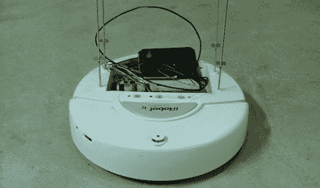

# 由安卓手机控制的声控机器人

> 原文：<https://hackaday.com/2011/07/05/voice-controlled-robot-controlled-by-an-android-phone/>

[杰夫]送来一个他刚刚完成的基于[安卓 ADK](http://developer.android.com/guide/topics/usb/adk.html) 和 [iRobot 创作](http://store.irobot.com/shop/index.jsp?categoryId=3311368)的[声控机器人](https://funwithdc.wordpress.com/2011/07/05/voice-controller-irobot-create/)。

机器人能够服从语音命令，告诉它去哪里。目前，机器人可以对前进、后退、向左、向右、停止和“工作时吹口哨”做出反应这是对 Android ADK 和一些明显应用的创造性使用，但这个项目真正的亮点在于对 [instructables](http://www.instructables.com/id/Voice-Controlled-iRobot-Create/) 的报道。我们很少看到一个项目被如此完整地记录下来；对于想涉足机器人领域的人来说，这是一个伟大的项目。

[Jeff]的文章介绍了将 ADK 电路板连接到 iRobot 并提供所有电子必需品的步骤。如果有人想加入他的项目，【杰夫】大方地为他的机器人提供了代码。

[杰夫]目前努力的最终目标是类似于[乌龟机器人](http://www.youtube.com/watch?v=MOEjL8JDvd0)的东西，同时保持机器人的语音控制。总之，一个非常好的项目。