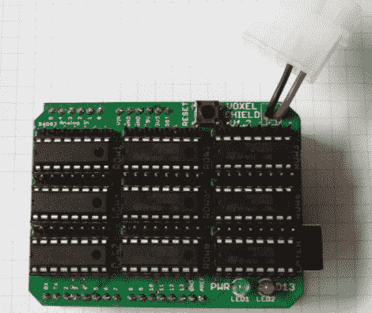

# 体素屏蔽使驱动 LED 立方体变得容易

> 原文：<https://hackaday.com/2011/09/26/voxel-shield-makes-driving-led-cubes-easy/>

Arduino 可以独自运行一个小的 LED 立方体，但如果你打算建造一个大的，最终你会用完引脚。对于像 8×8×8 的立方体这样的东西，你可能不得不求助于移位寄存器来完成工作。虽然你可以自己设计一个充满移位寄存器的分线板，但[Connor]已经为你完成了这项工作，并制作了一个易于使用的 Arduino LED 立方体盾牌。

他将他的发明称为体素屏蔽，它包含 9 个 SN74LS595N 移位寄存器和一个外部电源插头，可以满足所有 LED 立方体的需求。该屏蔽可以处理多达 512 个 LED 的寻址，使其成为驱动 8x8x8 立方体甚至 64×8 LED 矩阵的简单方法。

这是驱动大量 led 的一种干净而紧凑的方式，所以如果你有需要，一定要访问他的网站——他已经向所有人提供了他的原理图和电路板布局文件。

[谢谢，托马斯]