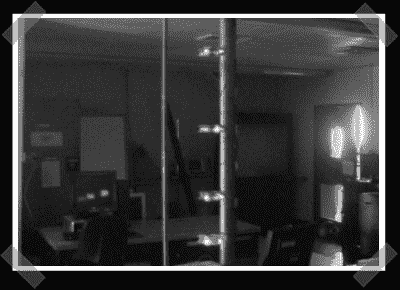

# 武凡-VU 流量计

> 原文：<https://hackaday.com/2007/08/16/vufan-vu-meter/>

[这个](http://www.cemetech.net/projects/ee/vufan/)黑客并不完全是那样，但我给它的创意加分。[Christopher]拿出一些蓝色 led 电扇，用它们做了一个巨大的 VU 电度表。每条 I/O 线都有一个晶体管来驱动 TIP120 FET。就我个人而言，我希望看到更多的烟囱首尾相连，从烟囱后面的管道中排出雾气。

*   [永久链接](http://www.cemetech.net/projects/ee/vufan/)