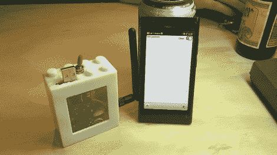

# Zigbee 驾驶

> 原文：<https://hackaday.com/2012/02/29/wardriving-for-zigbee/>

Wardriving 最初是在热点流行之前搜索无保护的 WiFi 接入点。所以[特拉维斯·古斯比]组装的这个 ZigBee 协议驱动硬件真的给了我们一种对那个时代的怀旧感。不要误解我们，我们喜欢无处不在的 WiFi 接入，不希望回到简单的时代。但是，如果你要寻找的无线电信号很少，定位它们是一个挑战。

普通读者会意识到[Travis]对射频的所有东西都感兴趣。他的一个项目包括[凭空嗅出无线键盘包](http://hackaday.com/2011/02/07/sniffing-rf-hardware-communication-packets/)并将它们显示在他的诺基亚 N900 的屏幕上。这是正确的，但他已经升级到 N9 手机的显示硬件。他切换了射频硬件，使用 TelosB(他已经熟悉的板[)来获得 802.15.4 ZigBee 频谱。这个开发板有一个扩展端口，允许他使用 RN42 模块与手机进行无线通信。这意味着嗅探硬件可以藏在背包或夹克里。毕竟，没有人会质疑一个盯着智能手机走来走去的人。](http://hackaday.com/2009/03/15/zigbee-aes-key-sniffing/)