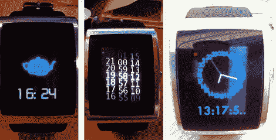

# 观察黑客，一天一次

> 原文：<https://hackaday.com/2011/04/27/watch-hacking-one-day-at-a-time/>

如果说有什么东西是黑客一次又一次回归的，那就是时钟/手表黑客。总是有创新的方法来告诉时间，随着市场上几种“可破解”手表的出现，肯定不会缺少整洁的时钟破解。

来自纽约电阻器公司的[hudson]决定在下个月围绕他的可编程脉冲手表[接受一项有趣的挑战。在接下来的 ~~30~~ 27 天里，他将为这款时计设计、编程并发布表盘。他已经落后 3 天了，](http://www.nycresistor.com/2011/04/26/30-days-of-watches/)[，结果非常有趣。这些概念是创造性的和功能性的，尽管由于时间的限制，它们有时不如他所希望的那样完美。](http://osresearch.tumblr.com/)

如果你有一个 inPulse 手表，并且想继续玩下去或者改进他的工作，所有的代码都可以在他的 Bitbucket 页面上找到。

我们认为这是一个非常酷的项目，我们渴望看到他每天的成果。留下来看一个展示他的 3D 手表脸的快速视频。