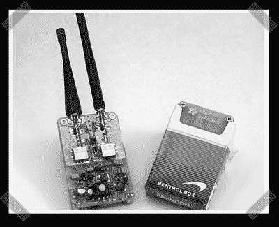

# 波泡便携式射频干扰器

> 原文：<https://hackaday.com/2006/12/25/wave-bubble-portable-rf-jammer/>

一天黑一次的朋友[ [利莫尔](http://ladyada.net) ]又名【ladyada】已经承诺了一段时间的便携式射频干扰器。猜猜她送我什么[圣诞礼物](http://www.ladyada.net/make/wavebubble/)？Wave-bubble 是一款自调谐射频干扰器，适用于 20 英尺左右的射频强制干扰。(它输出 0.1-0.3 瓦)通过一对效率较低的天线，它甚至可以装进一包香烟里。她永远不会卖这些，因为联邦通信委员会会来敲门，但如果你有一些主要技能，你也许可以建立一个。(我会相信她对这一点的看法，我亲眼见过她的作品，这是一些该死的好东西)

圣诞快乐！立即获得您的[设计挑战](http://www.hackaday.com/category/contests/)参赛作品！

*   [永久链接](http://www.ladyada.net/make/wavebubble/)