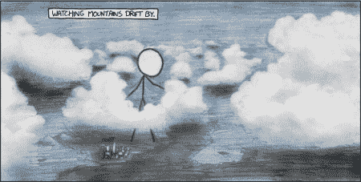

# 我们不需要头脑风暴项目；Xkcd 为我们做了这些

> 原文：<https://hackaday.com/2011/08/23/we-dont-need-to-brainstorm-projects-xkcd-does-that-for-us/>

我们最喜欢的网络漫画 *xkcd* 背后的家伙【兰道尔·门罗】，给了我们[又一个](http://xkcd.com/941/)伟大的项目想法，紧随[保护我们的贵重物品](http://xkcd.com/916/)和[消音汽车音响](http://xkcd.com/368)。xkcd 论坛[一直在讨论如何实现这个](http://forums.xkcd.com/viewtopic.php?f=7&t=73758)，我们想听听 Hack A Day 的读者对这个想法有什么看法。

这个项目和 3D 摄影没什么不同。基于这个基本上相当于大型双筒望远镜的想法，他做了很多艺术和实验。xkcd 论坛上的一张海报说[已经用镜子](http://eyestilts.com/)建造了这个，但是我们想知道用这种方法可以增加多少视差。两个摄像头和一部智能手机还可以根据头部运动自动进行平移和倾斜。

我们不太确定这个想法是否能应用于天文学。人眼的[角分辨率](http://en.wikipedia.org/wiki/Naked_eye)约为 1 弧分，除太阳外，每颗恒星的年视差都小于 1 弧秒*。如果有人想尝试更长的基线(例如从地球到冥王星)，我们建议在[星际馆](http://www.stellarium.org/)进行模拟。不过，如果相机之间的距离只有几百英里，就有可能把月亮看成一个球体。*

 *请在评论中告诉我们你将如何构建它，如果你成功构建了它，请务必[提交你的评论](http://hackaday.com/contact-hack-a-day/)。我们马上把它放上去。

感谢[Theon144]发送此邮件。

编辑:因为这些评论实际上正在开花结果，看看 Hack A Day 论坛上这篇文章的帖子: [链接](http://forums.hackaday.com/viewtopic.php?f=2&t=1069)。*