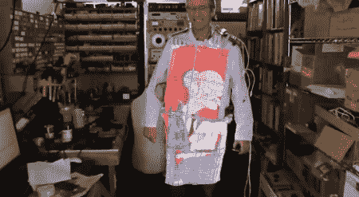

# 可穿戴视频外套

> 原文：<https://hackaday.com/2011/07/12/wearable-video-coat/>

大卫·福布斯对怪异和深奥并不陌生，所以他创造了一个内置在实验室外套中的彩色 LED 电视。他计划下个月把它带给燃烧的人。

RGB LEDs 安装在窄柔性板上，提供 160×120 像素 NTSC 显示屏。视频处理由 Xilinx FPGA 负责，它从视频 iPod 获取 YCrCb 视频馈送，并将其转换为四个独立的 RGB 流，分别用于正面、背面和两侧。对亮度和颜色的必要控制在肩膀上。

当然，如果没有将任天堂插入实验室外套的能力，这个版本就不会太夸张，所以 RCA 插孔上有一个 NTSC 输入。一切都是由两个 11.1 V，5Ah 无线电控制脂电池组供电，应该可以供电一段时间。

查看下面的 LED 实验室外套视频。

[https://www.youtube.com/embed/jtSm8Oom2n4?version=3&rel=1&showsearch=0&showinfo=1&iv_load_policy=1&fs=1&hl=en-US&autohide=2&wmode=transparent](https://www.youtube.com/embed/jtSm8Oom2n4?version=3&rel=1&showsearch=0&showinfo=1&iv_load_policy=1&fs=1&hl=en-US&autohide=2&wmode=transparent)