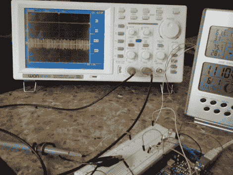

# 气象站转向数据记录器

> 原文：<https://hackaday.com/2011/03/15/weather-station-turned-data-logger/>

家庭酿造完美的啤酒(或根汁啤酒)需要一双警惕的眼睛和稳定的温度，但[格雷戈里]有一座 120 年历史的房子。虽然我们肯定这是一个美丽的家，但它确实有其常见的历史问题，包括温度波动。

[Gregory]怀疑这是他的根啤酒不碳酸化的原因，但为了 100%确定，他拿了一个带有无线远程温度计的气象站(和原子钟)并被黑了。在拆开电台后，他能够迅速隔离无线电接收器并找出信号，几个到 arduino 的连接，现在他可以在电脑上记录温度。

希望他能发现这是不是他的问题。休息之后，请加入我们，观看一段简短的视频。

[https://www.youtube.com/embed/TzqY5HxrZyM?version=3&rel=1&showsearch=0&showinfo=1&iv_load_policy=1&fs=1&hl=en-US&autohide=2&wmode=transparent](https://www.youtube.com/embed/TzqY5HxrZyM?version=3&rel=1&showsearch=0&showinfo=1&iv_load_policy=1&fs=1&hl=en-US&autohide=2&wmode=transparent)