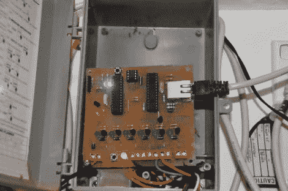

# 网络控制自动喷水灭火系统

> 原文：<https://hackaday.com/2010/09/16/web-controlled-sprinkler-automation/>

[道格]需要更新他的供水系统，以符合他的城市的新节水条例。旧系统不能被编程为只在偶数或奇数日历日浇水。他决定建造自己的洒水控制器，而不是购买替代品。它需要转换 12V 螺线管，这是一项不难设计的工作。他没有重新发明轮子，而是修改了以前的控制器设计。它基本上是一个 Arduino 和以太网屏蔽在他自己的蚀刻板上。除了 ATmega328 和 ENC28J60(用于以太网连接)之外，还有一组晶体管来驱动浇水螺线管。现在，他有了一个控制浇水时间表的网络界面，并且完全符合新的城市法规。

如果你在给草坪浇水时需要其他节约的方法，你应该看看[避人行道洒水器](http://hackaday.com/2009/09/04/variable-range-sprinkler/)。