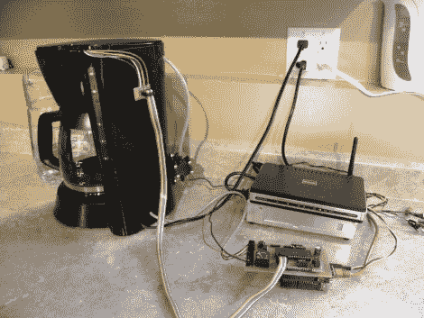

# 网络咖啡机让你的休息时间变得过于复杂

> 原文：<https://hackaday.com/2011/12/05/web-enabled-coffee-maker-over-complicates-your-break-time/>

有些人认为研磨咖啡豆并装满咖啡机是喝咖啡仪式的一部分，但[杰米]不在其中。取而代之的是，他一直致力于使这台咖啡机成为一台联网设备。他将它作为课程项目的一部分来构建，并实现了自动制作一杯咖啡所需的大部分功能。

你可以看到一个小泵附在咖啡机的后面。它从一个水罐(从咖啡机的左侧可以稍微看到)中吸取水来填充蓄水池。他试验了几种不同的水位传感解决方案。他最近的作品是一个 PCB，上面有几条不同长度的走线。由于这些走线被水覆盖，可以通过 ADC 读取电压来确定水位。

他使用 Arduino 和以太网屏蔽来增加设备的连接性。问题是 Arduino 上没有足够的 ADC 引脚来读取水位传感器。因此，他添加了一个自建屏蔽，使用 PIC 进行 ADC 测量，并将数字数据推送到 Arduino。有点复杂，而且不能自动加载理由(还不行？).但这并不是说我们不欣赏复杂的咖啡技巧。