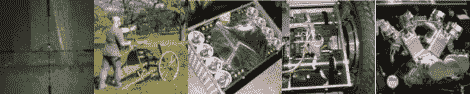

# 2011 年 3 月 9 日每周综述

> 原文：<https://hackaday.com/2011/09/03/weekly-roundup-090311/>

如果你第一次错过了它们，这里是我们过去一周最受欢迎的帖子。

我们最受欢迎的帖子是关于一个[“手电筒”的版本](http://hackaday.com/2011/08/31/the-life-and-death-of-a-fantastically-brilliant-flashlight/)。我们不严格地使用手电筒这个词，因为这个庞然大物能发出高达 500 瓦的能量。

我们的第二个最受欢迎的帖子是关于另一个[jrg Sprave]项目，他建造了一个非常大的弹弓，可以发射铅球。然后他开始用它摧毁一辆汽车。

这篇文章描述了一个开源的 Segway。它是围绕 ATmega644 构建的，外观非常专业。

如果你住在乡下，有老鼠的问题，这篇文章可能适合你。在这篇文章中，我们来看看[Snypercat]的建造，她在她的弹丸枪的瞄准镜上安装了一个摄像机，还安装了一个红外光源，这样她就可以在晚上狙击老鼠。

最后，我们有一个关于[定制 V-12 川崎航海家](http://hackaday.com/2011/08/31/engine-hacks-the-kawaskai-voyager-v-12/)的帖子。如果你正在寻找一个在下一次摩托车拉力赛上吸引注意力的好方法，这篇文章可能会给你一些启发。