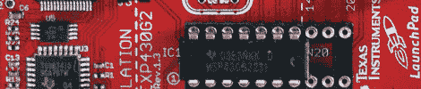
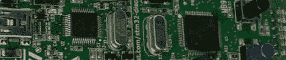
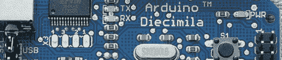
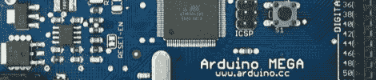
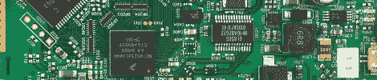
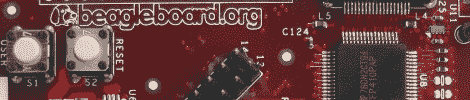
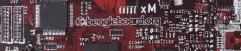

# 用什么开发板？

> 原文：<https://hackaday.com/2011/02/01/what-development-board-to-use/>

在 Hackaday，我们看到基于微控制器的项目处于各种完成状态。有时候从头开始设计系统是最有意义的，而在其他时候，如果希望简单或快速完成项目，预建系统板是更好的选择。我们编制了一份在您提交的项目中常见的电路板列表，按照价格范围进行了分类，并提供了一些参考信息。

阅读我们的列表后，在评论中或在[这个论坛帖子](http://forums.hackaday.com/viewtopic.php?f=2&t=142)上发表意见，我们可能会在以后的后续指南中包含您的董事会。我们还将向论坛上给出的最有见解、最具原创性和最有用的建议赠送 10 张 Hackaday 贴纸，所以如果你还没有注册，现在就是一个绝佳的时机。贴纸赠品的获胜者将从论坛帖子中选出，最终的奖品决定将由 Hackaday 写作团队的智慧和心血来潮来评判。更多奖品详情请关注下面的帖子。请继续阅读我们基于过去项目提交的指南。

**便宜(0-50 美元):**

谈到廉价电路板，用户可以期待一个简单的分线板，通常带有一些调试工具和最少的额外元件。这些主板倾向于面向业余爱好者和教育人群，而不是那些能够为他们的工程师提供全功能开发设置的公司。不幸的是，直接来自制造商的主板往往会锁定或过度简化 ide 或调试软件，尽管低廉的价格往往会激发开源社区编写自己的代码来利用所有功能。

*   ***TI 的 MSP430 Launchpad** :* 售价 4.30 美元， [TI 的 Launchpad](http://hackaday.com/2010/06/22/ti-makes-a-big-bid-for-the-hobby-market/) 板绝对是便宜货。花点钱，你可以得到一套 16 位 MSP430 处理器、一个迷你 USB 调试器和编程接口，以及一套可供选择的 Windows IDEs。没有太多可写的了，但我们已经介绍了许多由该系列微控制器运行的项目。
*   ***意法半导体的发现:*** 只花了你微不足道的 11.85 美元，这款 32 位 ARM 处理器可能是性价比最好的处理器之一。与 Launchpad 类似， [Discovery](http://hackaday.com/2010/10/12/arm-prototyping-on-the-cheap-with-stm32-discovery/) 有一个迷你 USB 接口，一个分离式编程器和调试器，以及一些锁定的 ide 可供选择。对于希望体验 ARM 架构的学生或专业人士来说，这款基于 Cortex-M3 的系统将是一个很好的起点。
*   Arduino 家族: 无需介绍，这些基于 8 位 AVR 的系统已经被我们展示了无数次。由于开源的硬件和软件设计，这些主板可以低至 20 美元左右的价格用于 [Arduino](http://hackaday.com/2011/01/19/arduino-the-documentary/) 兼容克隆，或者任何价格范围，取决于包括的外围设备。因为熟悉 C、C++或 Java 的人都熟悉简单的 IDE 和编码环境，所以 Arduino 是初学者、非工程类型和专业人员的常见选择。

**中档主板(50-150 美元):**

只要多花一点钱，开发板就能带来更多。这些主板通常具有更高的 I/O 引脚数，更复杂的接口，如主机 USB 端口、以太网或视频输出，是少量计算和功能人员的理想选择。然而，由于成本较高，在任何一次性项目中只投入其中一块板会更加困难。更昂贵的电路板通常也能得到更好的支持，因为它们是由决定重要采购决策的工程师使用的。这个区域也是从更硬的微控制器类型板到更强大的微处理器类型系统的过渡区域(例如从 Cortex-M 转移到 Cortex-A 系列 ARM 处理器)。

*   ***Arduino Mega:***出于与最初的 Arduino 相同的原因， [Arduino Mega](http://arduino.cc/en/Main/ArduinoBoardMega) 在原型或开发环境中有其一席之地。花比原来多一点的钱，就可以获得额外的代码空间、处理能力和 I/O 引脚，以及同样舒适、熟悉和相似的开发工具。Arduino Mega 售价 65 美元，这是一个昂贵的 8 位系统。
*   ***chum by Hacking Board:***一个有趣的产品从生产到事后原型制作的例子，[这款 board](http://wiki.chumby.com/mediawiki/index.php/Chumby_hacker_board) 基于 Chumby One 的核心，采用 454 MHz 的 32 位 Freescale i.MX ARM 处理器。该系统有视频输出，以及三个 USB 端口，用于所有外设，您可以找到或编写自己的驱动程序。Chumby Hacking board 的价格在合理的 90 美元左右，尽管供应似乎在减少，所以如果感兴趣就赶快行动吧。
*   ***最初的 BeagleBoard:*** 在价格范围的顶端，[beagle board](http://beagleboard.org/hardware)(C4 修订版)采用了 600 MHz Cortex-A8 ARM 处理器，能够运行许多 Linux 系统，包括 Angstrom 和 Ubuntu。这款主板旨在与触摸屏等酷玩具进行交互，还配有一个强大的 DSP 芯片，用于处理数字，以及处理视频和声音。以 125 美元的新折扣价，这款紧凑型动力装置就是您的了。

**上层地壳(150 美元以上)**

在这个价格范围内，这些主板通常包含 Cortex-A 系列的 ARM 处理器，并且与高端智能手机的共同点多于日常生活中常见的微控制器。像这样的主板是一项真正的投资，其成本和性能通常与许多老式或低端电脑和上网本相似，在大多数情况下，性能功耗比要高得多。这些主板倾向于运行基于 Linux 的操作系统，包括 Android 和其他系统。

*   ***BeagleBoard xM:***售价约为 150 美元，这款[老大哥](http://beagleboard.org/hardware-xM)为第一款 beagle board 增加了一些部件，如板载以太网、额外的 2 个 USB 端口和 1 GHz 处理器。虽然建议零售价为 149 美元，但高需求已经将价格推高到远高于有现货的地方。由于与最初的 BeagleBoard 非常相似，现有的社区非常强大，并且充满了让 Board 运行起来的例子和指南
*   ***panda board:***这款主板的功能与想象中的 8 位微控制器相去甚远，而[则完全采用了能够处理 1080P 视频流的双核 1 GHz 处理器。我们意识到这可能超出了 174 美元的任何“黑客”级项目的范围，但我们知道有一些工程师非常兴奋地看到这一点。](http://pandaboard.org/)

**总之:**

我们知道，品牌和体验偏好可能是一个强大的动力，所以请提出您的建议，并在我们的论坛上发表您对我们后续帖子的选择。我们将尽最大努力将您提供的所有信息整理成一个更明确的、有希望为初学者和专业人士提供更多信息的指南。