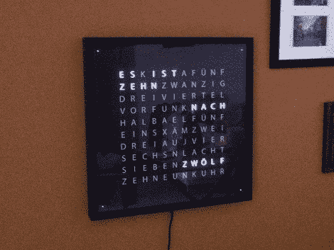

# 什么东西有 114 个发光二极管并且一直在运行？

> 原文：<https://hackaday.com/2011/09/29/what-has-114-leds-and-is-always-running/>

答案当然是字钟。这实际上是一个字钟的第二个版本。和第一款一样，它使用 114 个发光二极管从背后照亮显示屏上的文字。

在他的第一次迭代中，他使用 Arduino 来驱动 Charlieplex 阵列灯。这是一个 11×10 的网格，加上四个发光二极管，以点的形式在钟面的每个角落显示中间的分钟。这一次他仍然使用 Arduino，但灯光有了巨大的升级。在他的一张构建图片中，您可以看到一卷 RGB led 模块，每个模块上有两个 RGB led 和一个 HL1606 驱动器。这些器件由 SPI 控制，只需几个数据和电源总线轨，就可以轻松连接。休息后看看测试视频，它展示了这个网格的能力。

如果你不知道上面显示的是什么时间，你可以查看一下英文版的单词钟面来帮助你自己制作。