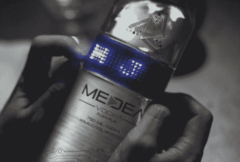

# 你的伏特加配什么 LED 矩阵？

> 原文：<https://hackaday.com/2010/04/14/what-kind-of-led-matrix-does-your-vodka-come-with/>

美狄亚伏特加配有一个瓶子，里面有一个蓝色滚动 LED 字幕。好的，很好？这是一个有趣的营销策略，但你不觉得有点浪费吗？朋友们，重新利用这个硬件取决于我们。侵入可编程显示器并让它为你服务不会那么难。我们的朋友谷歌告诉我们，你可以花大约 40 美元买到这个 750 毫升的瓶子。这比一瓶还过得去的伏特加的售价高出约 25 美元，对于打开硬件寻找乐趣和利润的挑战来说，这只是杯水车薪。不要忘了记录你的工作，一旦你完成了什么，就[给我们提示](http://hackaday.com/contact-hack-a-day/)。休息之后看美狄亚的编程教学视频。哦对了，记得先黑后喝…便宜的烙铁会变热！

[https://player.vimeo.com/video/7817799](https://player.vimeo.com/video/7817799)

[感谢 LoopyMind via [理想化](http://www.idealize.nl/2010/04/schiedamse-wodka-heeft-instelbaar-led-label)