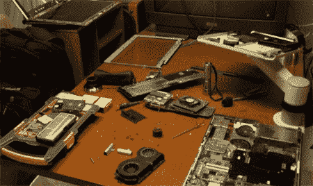

# 如何处理旧笔记本电脑？

> 原文：<https://hackaday.com/2008/05/22/what-to-do-with-an-old-laptop/>

回到 11 月[，我们问](http://www.hackaday.com/2007/11/11/hackit-new-life-for-old-laptops/)你会如何处理一台不用的旧笔记本电脑。如果你有一台旧笔记本电脑，除了积灰之外没什么用，那么你可以更好地利用它。你可以卖掉它，但你可能不会得到太多。捐赠或回收也可以让它远离你的头发，但是如果你想尝试一些不同的东西，请继续阅读。

 
回收有用的部分
不是最时髦的选择，但可能是最有用的。仅仅因为处理器和 RAM 不再满足您的需求，并不意味着硬盘、光驱甚至液晶屏也应该扔掉。所有这些部件都可以很容易地拆除，除了屏幕在某些情况下，不需要完全拆除。移除任何这些部件时，请小心移除所有安装螺钉，并在从机箱中移除之前小心分离所有电缆。液晶显示器几乎总是有一根电缆直接连接到主板上，撕掉它会使显示器变得无用。如果你弄坏了它，你将不得不买一个新的显示器来扩展你的桌面显示器。

当然，你也可以从旧笔记本电脑中获得大量的小零件，包括螺丝、跳线、散热器、电缆、led，甚至键盘上的按键。FRC Tech 为拆卸笔记本电脑的基础知识提供了一个很好的指导页面，ThinkComputers.com 的一个论坛为拆卸许多不同的东芝笔记本电脑提供了一套全面的指南。
  
制作一个数码相框
一个数码相框可以是你亲手制作的一份大礼。你妈妈可能会比你三年级时做的陶瓷笔筒更喜欢它。不过，与那次不同的是，你必须决定这个框架是只显示预加载的图像，还是可以访问 Flickr 等在线资源。PopSci.com 和 Repair4Laptop.org 为你提供了制作自己相框的实用指南。
  安装 Linux 并制作一个媒体扩展器
旧笔记本电脑不擅长运行内存或处理器密集型软件，但它们可以制作出色的 Linux 终端。你可以给它装上 Linux，专门用于互联网、数据存储，甚至控制其他设备，比如家庭娱乐中心。不幸的是，为了更好地利用它，你可能还得改装一个更大的硬盘或 WiFi 卡。昨天[我们提到](http://www.hackaday.com/2008/05/21/media-streamers-buy-or-build/)两个[流言电视台](http://www.mythtv.org/modules.php?name=Downloads)和 [XBMC](http://xbmc.org/wiki/?title=Linux_port_project) 作为备选前端。Linux.com 的这篇文章有更多关于构建 Linux 家庭媒体中心的信息。还有由媒体中心专家撰写的[这篇指南，或者由 ZDNet 的 George Ou](http://mediacenterexpert.blogspot.com/2007/05/building-linux-media-extender-for-your.html) 撰写的[这篇文章。](http://blogs.zdnet.com/Ou/?p=321)  
通过升级获得创意
当然，你可以做标准的改装并添加 WiFi 或蓝牙，但为什么不尝试一下你的改装呢？你可以给旧笔记本电脑一个[时髦的木箱模块](http://www.hackaday.com/2005/03/09/wooden-laptop/)，一个极其强大的[风冷系统](http://www.hackaday.com/2007/05/20/forced-air-laptop-cooling/)，或者换成 qwerty 键盘，换成 [Dvorak 键盘](www.hackaday.com/2007/03/01/diy-dvorak-keyboards/)。你的想象力是极限。

本着我们之前帖子的精神，你会怎么做？