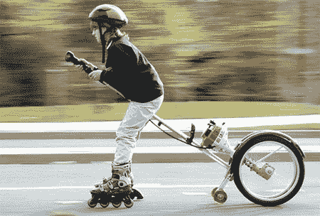

# 轮子和除草机

> 原文：<https://hackaday.com/2008/06/06/wheels-and-weed-whackers/>

也许你在之前已经[见过这张图片:一个年轻的孩子穿着一双直排轮滑鞋，被一辆除草机推着前进。虽然这个装置的说明看起来相当明显(将轮子安装在除草机上)，但文章似乎并不存在。如果你有任何信息，让我们知道，但同时，享受这些其他除草机供电项目。](http://gizmodo.com/5013586/one-kids-journey-on-a-weed+whacker-broom-skate-thing)

<http://www.youtube.com/v/uruaRsCHvk4&amp;hl=en>

 
为了好玩和实用，我们就从这辆[除草机自行车](http://www.mahalo.com/Weed_Wacker_Bike)开始。它使用一个回声 SRM-210 微调电机。自行车的踏板被第二个链轮取代，链轮由连接到马达的链条驱动。据报道，这辆自行车的时速可达 25 英里/小时和 100 英里/小时。这些马达的好处是不管方向如何，它们都能工作。

<http://www.youtube.com/v/7h7AmVPpaEY&amp;hl=en>

 
我们发现了另一辆由除草机马达辅助的自行车，但这辆自行车没有移除踏板和为齿轮提供动力，而是简单地连接了一个带有模型飞机螺旋桨的 31cc 除草机。螺旋桨提供推力，但不要指望这种设计会像以前的设计那样有效。

如果你认为我们在讨论溜冰鞋的时候谈论自行车是在作弊，请慢下来。相信我们，当你穿上这些溜冰鞋时，你真的会希望自己能慢下来:它们装有 25cc 的电机，安装在右冰鞋的背面，可以达到 20 英里每小时的速度，就像照片中的孩子一样。这些都是中国制造商定做的，只是[懒得在英国买一双](http://blog.wired.com/gadgets/2007/07/gas-powered-ska.html)。