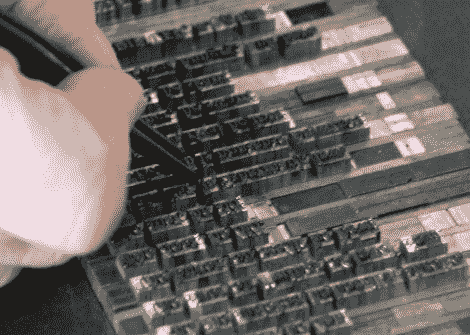

# 为什么我们不生产自己的打印机？

> 原文：<https://hackaday.com/2010/01/26/why-arent-we-building-our-own-printers/>

我们会再问一遍，为什么我们不自己造打印机？我们正在建造 [3d 打印机](http://hackaday.com/2010/01/12/how-to-make-a-printable-ces-badge/)、[数控铣床](http://hackaday.com/2010/01/17/cnc-brought-to-you-by-zip-ties/)、[在商用打印机上改装墨盒](http://hackaday.com/2009/07/08/continuous-ink-project/)。制造一台 300 dpi 的黑白打印机到底需要什么？能让你清洁和维护打印头而不是在墨水容器空了的时候扔掉它的东西？

有人已经开始用 Openprinter 项目来回答这些问题。如果你对此感兴趣，加入并开始革命。 [RepRap](http://hackaday.com/2009/08/27/reprap-wedge/) 有着简单的开端，也许是时候带着自我复制的 3D 打印机大军，用它们为 2D 打印机打印零件，而不是[让我们发疯](http://theoatmeal.com/comics/printers)。

[ [照片来源](http://www.today.ucla.edu/portal/ut/prof-revives-lost-art-of-printing-press-111145.aspx)

[通过[螺丝](http://lostscrews.com/viewtopic.php?f=7&t=25)