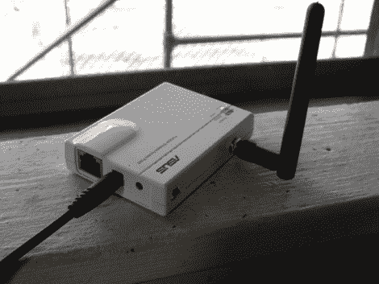

# WiFi AP 获得天线增强

> 原文：<https://hackaday.com/2010/09/23/wifi-ap-gets-antenna-augmentation/>

感觉糟糕的是，他的接入点被拥有更强外部天线的型号取笑，[客户服务]决定做点什么。在打开华硕 wl-330ge 后，他发现增加一个连接器很容易。该接入点有两个非常小的内置天线，使用弹簧连接到 PCB 上的信号和接地焊盘。这些焊盘相当大，而且是分开的，很容易焊接连接。从一台旧设备上取下一个天线连接器，[客户服务]将其焊接到位，并在塑料外壳上钻了一个安装孔。在刷新了 DD-WRT 的固件后，他现在已经从这个小家伙身上得到了他想要的一切。