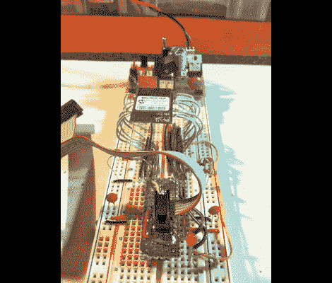

# ATtiny 微控制器的 WiFi 实验

> 原文：<https://hackaday.com/2012/02/07/wifi-experiments-with-attiny-microcontrollers/>

[Quinn Dunki]从 Element14 获得了一些免费的东西进行评估，包括这个微型芯片 WiFi 模块。过去它曾被用作 Arduino 护盾的核心，她拿了一份这个库的拷贝，看看它是否能与 ATtiny 芯片配合使用。接下来是[一场解码 Arduino 代码的斗争，以便它可以移植到所有 AVR 控制器上](http://quinndunki.com/blondihacks/?p=840)。

这个模块是将 WiFi 添加到项目中最便宜的方式之一，价格约为 23 美元。但它并不是真正的一体化解决方案，因为仍然有一个巨大的软件障碍需要跨越。硬件提供与网络通信所需的无线电功能，但您需要提供 TCP/IP 堆栈和支持它的一切。因此重用了 Arduino 库。

与逆境作斗争[奎因]与它打了一场漂亮的仗。从 ATtiny 切换到 ATmega168，编译更多代码，并对该过程进行故障排除。她使用单个 LED 作为反馈，并可以通过她的热点获得一些连接。但是到目前为止，她还没有做好一切准备。

我们迫切需要一款便宜易用的 AVR WiFi 解决方案。但正如我们在这里看到的，软件是复杂的，也许最好留给更强大的硬件，如 ARM 控制器。你怎么想呢?