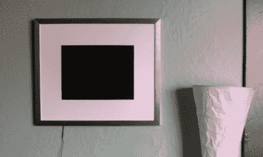

# Wifi 嗅探数码相框

> 原文：<https://hackaday.com/2011/06/13/wifi-sniffing-digital-picture-frame/>

[AUTUIN]为他的 [wifi 嗅探数码相框](http://freegeekvancouver.blogspot.com/2011/06/another-hack-wiretap-picture-frame.html)发送了一条提示。

一台即将报废的奔腾 II 笔记本电脑从温哥华免费极客那里被解救出来。温哥华周围的许多咖啡店都以当地艺术和免费 wifi 为特色，所以[AUTUIN]决定将两者结合起来。该项目旨在挂在咖啡馆的墙上，嗅闻无线网络上传输的图像——这是对隐私的侵犯，但正如[AUTUIN]所说，“这是一种意义。”

在将笔记本电脑的内部掏空并放入定制的相框后，安装了一个名为 [Driftnet](http://www.ex-parrot.com/~chris/driftnet/) 的程序，它可以监听网络流量并从 TCP 流中提取图像。[AUTUIN]在他的建筑中用开放的无线连接测试了他的建筑。结果提供了一个精彩的故事，从新闻网站的图片开始，然后慢慢转移到热门或不热门网站、在线约会网站的图片，最后是浏览会话不可避免的结论。

[AUTUIN]现在正在温哥华寻找一家勇敢或愚蠢的当地咖啡店，以展示他的 wifi 嗅探相框。我们认为，如果我们不使用那个网络，这将是非常有趣的，并不是说我们有什么要隐藏或什么的。