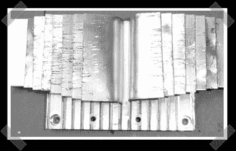

# Wii 笔记本电脑操作指南(第一部分)

> 原文：<https://hackaday.com/2007/01/23/wii-laptop-how-to-part-1/>

[本的 Wii 笔记本电脑操作指南系列的第一部分](http://www.engadget.com/2007/01/23/how-to-make-a-wii-laptop-part-1/)开始了。本花时间讨论 Wii 的内部结构，启动他的 CAD 流程来设计外壳，并使它比以前更小。因为 Wii 一开始太小了，我想很多人以为他只是把它塞进一个盒子里，然后加上了显示屏。

*   [永久链接](http://www.engadget.com/2007/01/23/how-to-make-a-wii-laptop-part-1/)