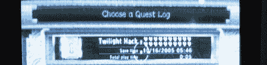

# Wii 菜单 3.3 已经绕过

> 原文：<https://hackaday.com/2008/06/19/wii-menu-33-already-circumvented/>

嗯，没多久。Wii Menu 3.3 更新发布三天后(通过[杀死一个特殊黑客](http://www.hackaday.com/2008/06/17/wii-upgrade-breaks-twilight-hack/)阻止自制程序在 Wii 上加载)，[更新被绕过](http://hackmii.com/2008/06/june-16-wii-update/)。此次更新针对无处不在的[暮光之城黑客](http://wiibrew.org/wiki/Twilight_Hack)，它允许通过使用特殊的游戏保存从 Wii 的 SD 卡插槽加载自制软件。HackMii 的团队很快对更新进行了分解、分析和嘲笑，成员[bushing]开玩笑说“我们没有被打动。”该团队在更新中发现了新代码的漏洞，导致它忽略了暮光之城的黑客攻击。他们还没有向公众发布补丁，但很可能他们会尽快发布补丁。

[via[Wii Fanboy](http://www.nintendowiifanboy.com/2008/06/19/twilight-hack-protection-already-beaten/)
[图片: [cibomahto](http://flickr.com/photos/cibomahto/2334430642/)

*   [永久链接](http://hackmii.com/2008/06/june-16-wii-update/)