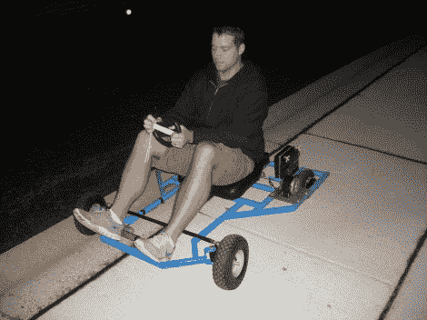

# Wii 遥控你乘坐的汽车

> 原文：<https://hackaday.com/2011/10/29/wii-remote-controling-the-vehicle-youre-riding-in/>

确保你的健康保险费全部付清；如果你决定复制这个项目，你可能需要它。[科里]、[克里斯]和[杰斯]建造了他们自己的用 Wii 遥控器控制的[推车。该网站有一个糟糕的导航方案，但如果你将鼠标悬停在水平菜单栏上，你可以获得相当多的关于构建的信息。](http://aidanscollegefund.com/)

这辆车有两个马达，用链条驱动每个后轮。一对 H 桥控制器让 Arduino 与之接口。它还有一个蓝牙模块，可以轻松地从 Wii 遥控器上获取加速度计数据。前端看起来像它使用齿轮齿条式转向，但你不会发现一个小齿轮或转向柱。相反，线性致动器平行于机架安装，在 Arduino 的命令下前后移动。

我们不禁回想起无声电影，在追车过程中方向盘松了。休息后观看演示时，看看您是否会得到相同的图像。这看起来不像给全尺寸汽车添加遥控器那么危险，但是我们以前玩过 MarioKart Wii，知道加速器性能有多糟糕。如果控制器中的电池没电了，固件有希望杀死马达。

[https://www.youtube.com/embed/BH04PnpoZP0?version=3&rel=1&showsearch=0&showinfo=1&iv_load_policy=1&fs=1&hl=en-US&autohide=2&wmode=transparent](https://www.youtube.com/embed/BH04PnpoZP0?version=3&rel=1&showsearch=0&showinfo=1&iv_load_policy=1&fs=1&hl=en-US&autohide=2&wmode=transparent)