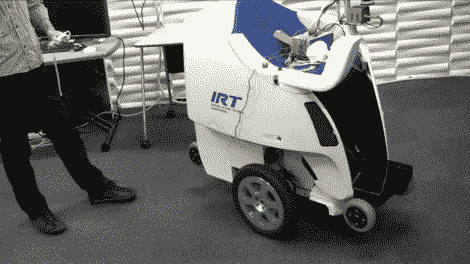

# Wii 遥控平衡轮椅

> 原文：<https://hackaday.com/2010/04/25/wii-remote-controlled-balancing-wheel-chair/>

个人移动机器人(PMR)有一个乘客座椅，像赛格威一样在两个轮子上保持平衡。现在，东京大学的聪明人在全尺寸版的[seg Wii](http://hackaday.com/2009/01/29/the-segwii/)平台上添加了 [Wii 遥控器。我们知道在任何东西上添加 Wiimote 控制在这一点上并不完全是开创性的。也就是说，如果使用库存硬件可以提高像轮椅这样的东西的用户界面的质量，同时降低生产成本，我们都赞成。](http://spectrum.ieee.org/automaton/robotics/medical-robots/042210-personal-mobility-robot-operated-by-wii-controller)

[谢谢埃里克]