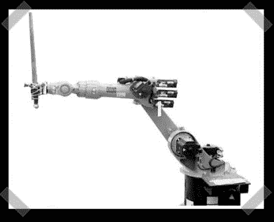

# Wii bot——武装而尖尖的

> 原文：<https://hackaday.com/2007/01/24/wiibot-armed-and-pointy/>

【布莱恩】提交了他的 Wiimote [黑客项目](http://www.usmechatronics.com/usmgarage/WiiBot.html)——他和他的团队用它来控制一个工业大小的机器人手臂。然后他们武装了它。请记住，剑是全尺寸的。[Aaron]最后写了一个基本的模式识别程序，让它以他们想要的方式运行。响应时间有点滞后，但对于一次性项目来说还不错。我需要自己的工业机器人。

*   [永久链接](http://www.usmechatronics.com/usmgarage/WiiBot.html)