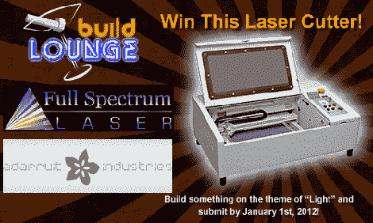

# 玩光赢激光切割机

> 原文：<https://hackaday.com/2011/10/07/win-a-laser-cutter-by-playing-with-light/>

Buildlounge 和 Full Spectrum Laser 已经决定[赠送一台激光切割机](http://www.buildlounge.com/2011/10/07/buildlounge-and-full-spectrum-lasers-are-giving-away-a-laser-cutter/)给任何想出最好的涉及光的项目的人。

这场比赛部分由阿达果工业公司赞助。比赛的焦点是*光*——只要围绕光设计一些东西，提交它，你就在自己的激光切割机的图纸中了。竞赛页面上建议使用太阳能烤箱、光电话、太阳能光纤照明和拆开一台旧的高射投影仪，但获胜的项目可能会酷得多。

参赛作品的截止日期是 1 月 1 日。一等奖是全光谱激光公司的 [40 瓦激光切割机](http://clonefs.simple-helix.net/products/40w-deluxe-hobby-laser)，二等奖是来自 Wicked Lasers 的[一个令人敬畏的绿色激光笔](http://www.wickedlasers.com/lasers/Core_Series-67-3.html)，三等奖是来自 Adafruit 的 [EL wire 启动器套件](http://www.adafruit.com/products/320)。参赛作品的截止日期是 1 月 1 日，所以我们期待从现在到新年期间，在 Hack A Day [tip line](http://hackaday.com/contact-hack-a-day/) 上看到很多精彩的提交。