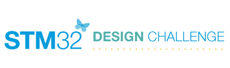

# 大获全胜:美国设计风格

> 原文：<https://hackaday.com/2010/11/08/win-big-american-design-style/>

上周，我们宣布了一个德国设计竞赛，只接受来自欧洲，中东和亚洲的申请人。不幸的是，这遗漏了我们的一大部分读者。在四处搜寻了一番之后(以及来自[Flash Gordon]的一个有用的提示)，我们设法找到了由发现板的制造商意法半导体举办的一个类似的竞赛。这个比赛听起来很熟悉，所有被批准的申请人都有免费的发现板，最有趣和最有创意的项目有[奖](http://stm32challenge.net/prize-central)。~~现在官方规则页面似乎不见了，所以从技术上讲，你应该等待进入，但我们不能阻止你。~~看起来官方规则页面是[位于这里](http://stm32challenge.net/official-rules)。感谢[安迪]指出这一点。此外，看起来如果你住在波多黎各或魁北克，你也出局了。

如果你来自 EMEA 地区，错过了最后一场的[比赛，一定要回去看看有没有机会赢！此外，我们喜欢报道竞赛(尤其是那些向所有参赛者发放免费工具包的竞赛)，除了 STM 之外，还有读者知道有哪家开发商提供这种交易吗？我们希望](http://hackaday.com/2010/11/04/win-a-harley-in-this-design-contest/)[能收到您的来信](http://hackaday.com/contact-hack-a-day/)！