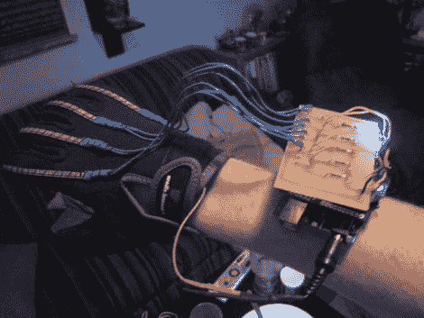

# 无线电子手控

> 原文：<https://hackaday.com/2011/03/28/wireless-animatronic-hand-control/>

[Easton]想参加当地的科学展，需要一个能让评委惊叹的项目。考虑了一会儿后，他决定电子手肯定会赢。我们看到的许多电子动画项目都连接到计算机上进行控制，但他的项目有点不同。

[Easton]希望能够用自己的动作实时控制手，所以他在手套上缝了一些 flex 传感器，并将它们连接到他制作的定制 Arduino 盾牌上。Arduino 还连接到 XBee 无线电，允许它与他的电子手无线连接。

为了更好地了解手指关节的位置以及它们是如何运动的，他在研究了解剖图后制作了这只手。他切割了一些柔韧的金属管道来建造手指，并用乐高积木加固它们。他将鱼线从指尖连接到五个独立的伺服系统，以提供手的运动。另一个带有 XBee shield 的 Arduino 用于控制手和接收来自手套的无线信号。

看看下面的视频，看看为什么这个项目在科学博览会上获得[Easton]第一名。

[https://www.youtube.com/embed/ZYKoNi48m9o?version=3&rel=1&showsearch=0&showinfo=1&iv_load_policy=1&fs=1&hl=en-US&autohide=2&wmode=transparent](https://www.youtube.com/embed/ZYKoNi48m9o?version=3&rel=1&showsearch=0&showinfo=1&iv_load_policy=1&fs=1&hl=en-US&autohide=2&wmode=transparent)