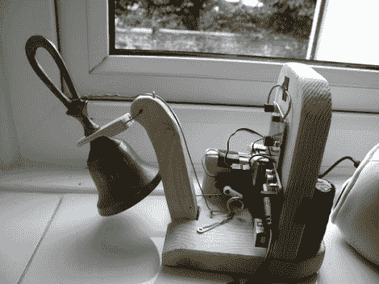

# 无线门铃响起真正的钟声

> 原文：<https://hackaday.com/2010/11/10/wireless-doorbell-rings-a-real-bell/>

厌倦了当访客碰巧经过时听到单调的无线门铃？不要去掉它，[增加一个真铃](http://www.psychicorigami.com/2010/09/06/ultimate-arduino-doorbell-part-1-hardware/)来改善它。这个黑客在无线门铃接收器上安装了一个小手铃。它的原型是用乐高积木将声音从铃声中抖出来，但最终版本是在一个木制框架上使用伺服电机。Arduino 监控无线接收器，当接收到来自前门按钮的传输时，驱动伺服系统。

传统上，门铃实际上是用螺线管敲击的[钟声。我们欣赏这种再现，因为它为家居增添了动态艺术的元素，将功能硬件暴露出来，而不是藏在盒子里。休息后不要错过演示。](http://hackaday.com/2010/09/01/replacing-the-driver-board-in-an-old-school-door-chime/)

这是完成的版本:

这是乐高版的。实际上我们更喜欢这个。

[via [Boing Boing](http://www.boingboing.net/2010/11/10/howto-make-a-bell-ri.html)