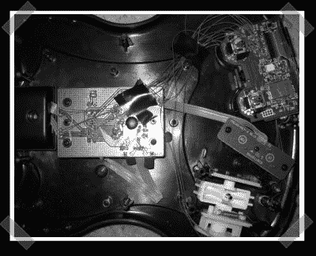

# 无线吉他英雄控制器

> 原文：<https://hackaday.com/2007/04/04/wireless-guitar-hero-controller/>

【约翰】发来了他的 PS3 无线吉他英雄项目。这个概念在今天的似乎很流行。希望他会写一些说明-但它看起来很直截了当-他在吉他英雄控制器的主体内嵌入了一个普通的 PS3 控制器。现在你可以看一下[的高分辨率版本](http://i153.photobucket.com/albums/s206/js3kgt/ps3%20guitar/IMG_0849.jpg)。更新:他传了一张[情侣](http://i153.photobucket.com/albums/s206/js3kgt/ps3%20guitar/IMG_0965.jpg)更项目的照片。更新 2:这是关于建立自己的[指令](http://instructables.com/id/E0C77GVF05IO1I3/)。

*   [永久链接](http://instructables.com/id/E0C77GVF05IO1I3/)