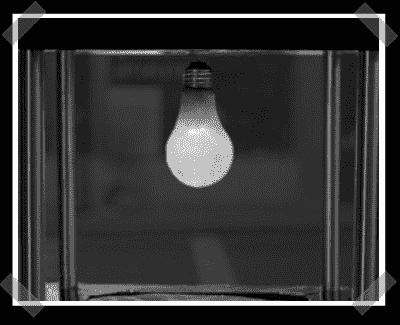

# 无线灯泡

> 原文：<https://hackaday.com/2007/06/08/wireless-lightbulb/>

【atrain】送来这个有趣的无线[灯泡](http://bea.st/sight/lightbulb/)。它更像是一个装在灯泡里的无线供电的 LED，但是你会明白的。灯泡内的线圈接收射频信号，交流信号经过整流后由发光二极管发出光。所有你需要建立自己的技术细节都在[这里](http://bea.st/sight/levitation/)。

*   [永久链接](http://bea.st/sight/lightbulb/)