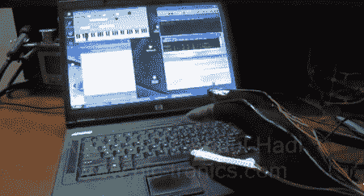

# 无线 MIDI 钢琴手套

> 原文：<https://hackaday.com/2011/11/07/wireless-midi-piano-glove/>

有时候你就是没有地方放一架小钢琴。[Abdullah]解决了这个问题，建造了一架虚拟无线 MIDI 钢琴。不像它的[灵感](http://www.youtube.com/watch?v=WYBzKFm-rd0)，它并不坏，但我们仍然喜欢它。

[阿卜杜拉]把他的手放在一些柔性传感器上，并把它们连在一只手套上。这些电阻传感器通过一个分压器发送到一个微控制器(我们认为是 PIC16F778 ),并选择相应的 MIDI 音符。这些 MIDI 音符被发送到电脑并通过扬声器播放。

现在，只有一个琶音被编码到微控制器中。根据弯曲的手指，在键盘上上下移动琶音。也就是说，固件可以很容易地修改，以识别标准的钢琴指法，这样就可以弹奏和弦了。唯一的问题是在键盘上上下移动手。

[Abdullah]正计划让他的手套完全无线化，将微控制器和电池缝在手套里。希望他会随时通知我们。

休息之后请欣赏[Abdullah]的演示。

[https://www.youtube.com/embed/9Z1sgXih6fw?version=3&rel=1&showsearch=0&showinfo=1&iv_load_policy=1&fs=1&hl=en-US&autohide=2&wmode=transparent](https://www.youtube.com/embed/9Z1sgXih6fw?version=3&rel=1&showsearch=0&showinfo=1&iv_load_policy=1&fs=1&hl=en-US&autohide=2&wmode=transparent)