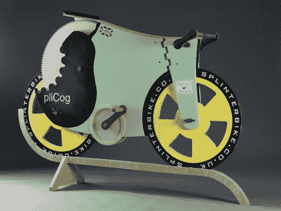

# 木制自行车希望创造世界纪录，而不是着火

> 原文：<https://hackaday.com/2011/04/28/wooden-bike-hopes-to-set-world-record-not-catch-fire/>

迈克尔·汤普森已经努力工作了六个多月，制造了一辆完全由木头制成的自行车。这个项目开始于两个朋友之间的打赌，在过去的几个月里变得越来越多。这种被称为“碎片自行车”的东西完全是由木质部件、胶水和油漆构成的，除此之外别无他物。

这款自行车使用了许多不同的木材，每种木材都有特定的用途。轮轴由硬木 ekki 制成，而所有的齿轮、轮子和框架部分都由桦木胶合板制成。由于其耐用性，涂油铁木被选为金属轴承的替代品。其他部分是用[迈克尔]在商店里随意丢弃的废料建造的，比如从一把旧扫帚上砍下的车把。

现在自行车已经完成了，[迈克尔]和他的朋友[詹姆斯]正准备创造一项木制自行车陆地速度世界纪录。这应该是可行的，因为他们已经计算出，如果[詹姆斯]能骑得足够快，自行车应该达到每小时 31 英里。创纪录尝试的日期尚未确定，但请密切关注——这可能是一场娱乐秀。

[通过 [Gizmodo](http://gizmodo.com/#!5796291/this-all-wood-bicycle-can-go-pretty-fast)