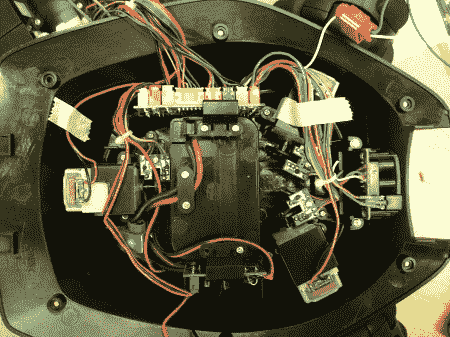
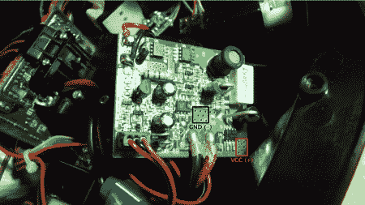
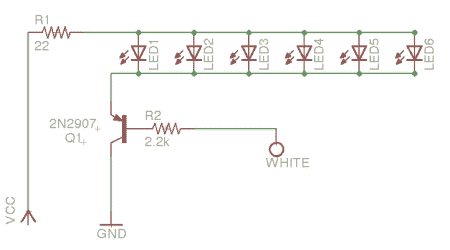
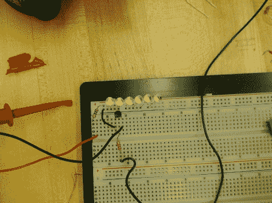
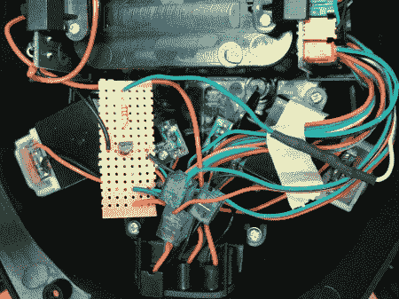
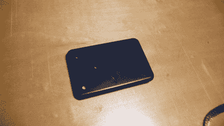
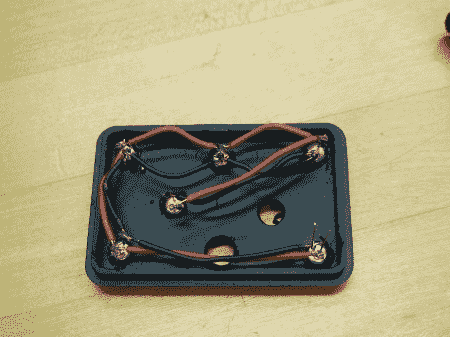
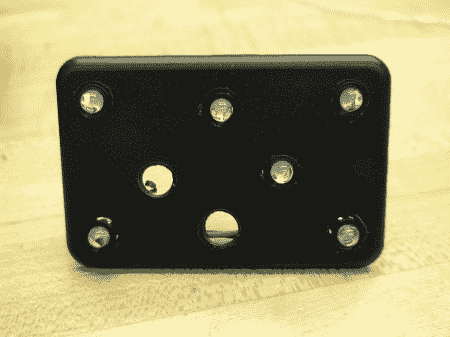
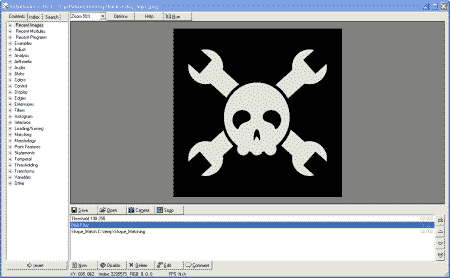

# Woot How-to:要有光！(适用于您的 Rovio)

> 原文：<https://hackaday.com/2010/03/17/woot-how-to-let-there-be-light-for-your-rovio/>

在我们开始操作之前，我们觉得应该解释一下这是如何发生的。你们很多人可能还记得，几个月前[我们参加了 CES 2010](http://hackaday.com/2009/12/28/hackaday-at-ces/) 。在那里，我们还参加了[它不会留在维加斯的博客聚会](http://itwontstayinvegas.com/)，最后在[见到了来自 Woot](http://hackaday.com/2010/01/09/ces-famous-people-at-ces/cimg0983/) 的家伙们。在我们所有人都花了一点时间欣赏开放的酒吧后，我们一群人站在一起聊了一会儿。突然，我们组的一个成员，杰里米·格罗斯，提出了哈卡戴和伍特合作的想法。基本上，他们会给我们一个关于他们将要销售什么的提示，然后我们会写一个如何用那个产品做一些酷的或者有用的东西的指南。然后，当 Woot 销售产品的时候，我们会发布我们的操作方法。你现在读到的恰好是这个想法在起作用，[hack aday 和 Woot](http://www.woot.com/Blog/ViewEntry.aspx?Id=11959) 的第一次正式合作。在这个操作指南中，我们将拆开 Wowwee Rovio 移动网络摄像头机器人，添加一些超级明亮的 led，以便在黑暗中更好地看到动作，并看看一些名为 [RoboRealm](http://www.roborealm.com/) 的软件如何赋予它一点人工智能。

如果你还没有 Rovio，你可能应该去 [Woot](http://www.woot.com/Blog/ViewEntry.aspx?Id=11959) 买一个，这样你就可以跟着去了。此外，当你在的时候，一定要在 [deals.woot](http://deals.woot.com) 买一份 RoboRealm。值得注意的是，在写这篇操作指南时，我们使用了由[鲁道夫]发布到 RoboCommunity 上的 [Rovio 头戴式 LED hack](http://www.robocommunity.com/article/13895/WowWee-Rovio-Hack-Head-Mounted-LED-Lights/) 的修改设计。

**零件**

–6 个超高亮白光 led(我们的额定电压为 3.3v，亮度为 7000mcd。)
–1 2n 2907 PNP 晶体管(我们在 RadioShack 的 15 晶体管组合包中找到了我们的晶体管。)
–1 个 22 欧姆电阻
–1 个 2.2k 欧姆电阻
–22g 固体连接线
–[radios hack 3x2x 1”项目外壳](http://www.radioshack.com/product/index.jsp?productId=2062279)(我们使用塑料背板作为安装 led 的地方。)
–5 毫米 LED 支架(可选。我们最后用它们把 led 安装在它们钻得很差的孔里。)
–热缩管(可选，但推荐。)
–一小块条板

我们从 RadioShack 上买到了大部分零件，但这些零件太常见了，你应该可以从任何电子元件商店买到。

拆卸

当然，为我们的 Rovio 提供一些急需的额外照明的第一步是拆卸它。将 Rovio 上下翻转后，卸下六颗十字螺丝，小心地卸下顶部外壳，以便能够接触到 Rovio 的内部部件。虽然你不能完全拆下顶部外壳，但你应该可以把它放在 Rovio 的底部，如上图所示。

Rovio 内部有两块主 PCB，控制板和电源板。就本操作指南而言，我们只需修改电源板。要接触到电源供应板，只需卸下垂直固定电源供应板的两颗十字螺丝。接触电路板后，您需要识别 PCB 上的接地和正极焊盘。我们稍后将接入这些焊盘，为我们的 led 阵列供电。我们感兴趣的另一个项目是从控制板到 LED 头灯板的白色电线。这条电线将允许我们通过 Rovio 的网络界面控制我们的新前灯。

点燃烙铁后，你需要将两根电线焊接到电源板上。正如你在上面看到的，有两个地方有很小的洞，可以很容易地到达 GND 和 VCC。焊接完这两根线后，将电路板拧回，然后将注意力转向前面提到的那根白线。切断白线后，将一段连接线焊接到其末端，并用适当尺寸的热缩管将其绝缘。此外，这可能是一个好主意，完全删除 LED 头灯板。这为你提供了三个开口，让你的电线从 Rovio 延伸到我们的新前灯面板。拆下电路板后，您可以切断通向红外 LED 和接收器的电线。这些功能就像一个面向前方的“雷达”,提醒用户前方是否有任何障碍物。我们决定挽救我们的，将它们放在我们即将创建的新面板中。如果你选择挽救你的红外“雷达”,那么记得在适当的引线和 LED 与接收器之间焊接延长线。我们实际上使用了一些电话接头连接器(来自 RadioShack)来延长通向红外接收器的三条线，但焊接应该可以正常工作。现在，您已经完成了 Rovio 的所有内部修改，我们可以继续这个黑客背后的电路。

**电路**

****

为了确保我们可以通过 Rovio 的网络界面控制替换的 LED 大灯，我们需要建立一个电路，通过网络界面检测大灯何时被触发，并相应地激活我们的大灯。为此，我们将使用 PNP 晶体管来切换前灯电路的接地。从上面的原理图可以看出，我们之前提到的白色导线将通过一个 2.2k 电阻连接到晶体管的基极，电源板的地将连接到晶体管的集电极，晶体管的发射极将连接到并联 led 阵列的地。如果你愿意，你可以在这个设计中多加几个 led。请记住，如果您改变 LED 的数量或类型，您将不得不重新计算 VCC 和并联 LED 阵列正极引脚之间的限流电阻器的值。在我们看完原理图并对其感到满意后，我们应该准备好进行试验板测试了。

如你所见，就元件而言，我们的电路没有那么多问题。黑线和红线直接来自电源板。我们的电压读数约为 6.5v。请注意，您的电压可能会因 Rovio 镍氢电池的电量而异。绿线焊接到 Rovio 内部的白线，并控制晶体管是否让地流向 led。我们发现，在试验板上测试该电路的最佳方式是打开 Rovio，并使用网络界面打开和关闭前灯。确认电路工作稳定后，您可以将电路焊接到某个 perfboard 上，并连接到 Rovio。

该电路在 perfboard 上并不占太多空间。我们决定利用电路板上的额外空间作为临时端子板来扩展红外 LED。将电路焊接到 perfboard 上时，一定要记住晶体管的方向。如果你不小心把它放反了，你可能会交换集电极和发射极，烧坏晶体管。我们提到这一点只是因为我们实际上是在第一次组装电路板时这样做的，最后我们不得不在重新组装电路板之前换上一个新的晶体管。在你组装好并确认你的电路工作正常后，我们可以继续组装我们的前灯面板。

**钻孔和布线**

****

在你的空白面板上，小心地钻 8 个你喜欢的任何形状的孔。钻孔时，一定要用 3/16 英寸的钻头。虽然它实际上比 5 毫米 LED 略小，但你可以旋转钻头一次或两次来扩大孔。最重要的是，你不想让 led 的孔太大，顺便说一句，我们最终做到了。其中一个太宽了，我们不得不改变 led 的位置，以确保它们都或多或少合适。

我不认为我需要在这里得到太多的细节，但主要的事情是要记住，发光二极管需要并联连接。此外，确保你是连接阴极到阴极和阳极到阳极，否则整个电路就不会工作。完成面板组装后，将 perfboard 的地线和电源板的 VCC 连接到电路，并使用 web 界面测试 led 是否在应该打开的时候打开。如果你决定打捞红外“雷达”，不要忘记将红外 LED 和接收器连接到板上留下的两个孔中。

完成钻孔和布线后，您应该准备好将面板连接到 Rovio。虽然这对我们来说有点棘手，但我们能够将面板用环氧树脂固定在 Rovio 正面的底部，这样它看起来就像是垂直安装的。

现在你的 Rovio 在黑暗环境下可以看得更清楚，让我们来看看 RoboRealm。

**机器人乐园**

****

在研究我们可以用 Rovio 做的所有不同事情时，我们偶然发现了一款名为 [RoboRealm](http://www.roborealm.com/) 的软件。RoboRealm 允许您从任何网络摄像头(包括 Rovio)获取视频输入，并通过任何数量的不同模块来处理图像。图像处理后，软件甚至可以查看是否满足任何预定义的条件，如果满足，它将指示机器人采取相应的行动。将视频输入与 Rovio 上音频输入/输出结合起来，您可以做一些非常酷的事情。这个软件有趣的地方在于，[正式支持 Rovio](http://www.roborealm.com/help/WowWee_Rovio.php) 开箱即用。我们有机会对它做了一点改动，据我们所知，它似乎是一个非常强大的软件。

我们已经知道我们想用这个软件和我们的 Rovio 做的所有很酷的事情，但我们很好奇，你会用它做什么？在评论中给我们留下你的答案，如果我们看到一些真正鼓舞人心的东西，我们会做一些研究，写下来，并发布一个操作指南来解释如何做到这一点。谁知道呢，甚至可能会有一个全新的 Rovio 和一份免费的 RoboRealm 给获胜者…