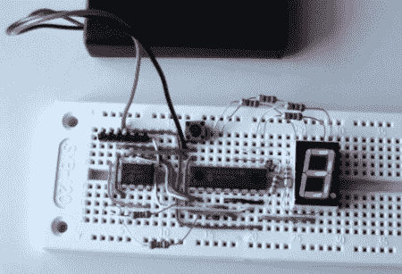

# 与 I2C 港口扩张公司合作

> 原文：<https://hackaday.com/2011/06/07/working-with-i2c-port-expanders/>

有时候，您的项目不需要太多的处理能力，但您确实需要大量的 I/O 引脚。仅仅为了获得额外的引脚而选择更大的微控制器通常没有经济意义，因此答案是使用端口扩展器芯片。[Raendra]发布了使用其中一种芯片的指南，这是一种微芯片 MCP23008 芯片，使用 I2C 协议进行通信。

你可能已经熟悉了使用 595 系列的移位寄存器进行端口扩展。使用 I2C 设备会有好处。其中之一是在使用多端口扩展器芯片时。使用级联移位寄存器，您必须始终移入整个芯片链的数据。但是 I2C 设备是可单独寻址的，所以你只需要通过 I2C 总线为需要改变的芯片推送数据，其他的不会受到影响。如果您的项目设计中已经有了另一个 I2C 设备，那么使用这些设备就特别容易，因为添加设备只需要连接 SDA 和 SCL 线。为了未来的事业，请记住它们。