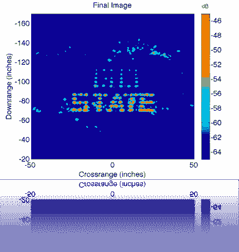

# x 波段线性轨道合成孔径雷达成像

> 原文：<https://hackaday.com/2010/06/17/x-band-linear-rail-sar-imaging/>

[Greg Charvat]非常想要高分辨率 X 波段线性轨道 SAR 成像系统。他非常想在业余无线电交换会上搜罗零件，直到他有足够的钱自己造一个。该装置用于拍摄高分辨率雷达图像。例如，上图由泡沫墙后面的图钉构成。[合成孔径雷达](http://en.wikipedia.org/wiki/Synthetic_aperture_radar)系统的价格约为 250 美元。一点也不差。您可能需要仔细阅读这些链接才能找到构建信息。请务必查看[硬件图库](http://www.mit.edu/~gr20603/Dr.%20Gregory%20L.%20Charvat%20Projects/$240%20Rail%20SAR%20hardware.html)和[示意图](http://web.mit.edu/gr20603/www/website%20pdfs/240dollar_railsar_notes.pdf) (pdf)。

[via [Makezine](http://blog.makezine.com/archive/2010/06/how-to_build_a_synthetic_aperture_r.html)