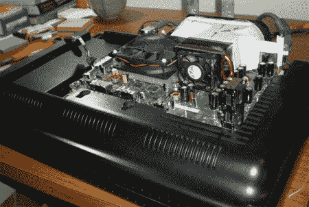

# Xbox 360 和液晶高清电视合二为一

> 原文：<https://hackaday.com/2008/07/09/xbox-360-and-lcd-hdtv-rolled-into-one/>

当你把一点[【本·赫克】的聪明才智](http://www.hackaday.com/2008/07/03/portable-nes-in-a-nes-cartridge/)，一点[的连立实用](http://www.hackaday.com/2008/06/23/xbox-360-modding-case-details/)，一台 Xbox 360 和一台液晶高清电视混合在一起会发生什么？你得到了微视 360，一个液晶高清电视和 Xbox 360 的组合。

mod 并不特别复杂。微视 360 的创造者[PvP_LostKnight]只是从 Xbox 360 的外壳中取出了工作部件，并将其安装在电视的背面。电视的一些输入必须移动和重新布线，并添加了一个重新利用和涂漆的特百惠容器来覆盖 Xbox 360 部件。不幸的是，[PvP_LostKnight]没有发表书面评论，甚至补充说“这种布线很可怕，我不建议任何人尝试这种方法。”

暂且把他的建议放在一边，他的设计的一些优点是改善了 Xbox 360 的气流和更好的空间利用率。我们最希望看到的是电源集成，一个按钮就可以打开两者，一个电源就可以为电视和 Xbox 供电。休息后观看概念验证视频，或阅读链接查看更多照片和评论。

<http://www.youtube.com/v/5rET7X0Zz20&amp;hl=en&amp;fs=1&amp;rel=0&amp;color1=0x3a3a3a&amp;color2=0x999999>

[via [Engadget](http://www.engadget.com/2008/07/09/microvision-360-hack-slaps-an-xbox-on-the-back-of-an-old-tv-for/)

*   [永久链接](http://www.pspmod.com/forums/pvps-archives/36276-microvision-360-a.html)