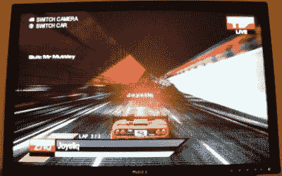

# Xbox 360 第一印象

> 原文：<https://hackaday.com/2005/11/27/xbox-360-first-impressions/>

在进入这个话题之前，我觉得有必要声明一下:我没有原版的 Xbox，我有一个 Playstation 2，我认为自己是一个休闲游戏玩家，我是开源的粉丝，而不是微软。

我在第一天购买了这个盒子，因为早期版本的游戏机一般更容易修改。与 PSP 版本。1.0 运行自制代码很容易，但随着每一个后续固件版本的推出，索尼都变得更加困难。由于硬件的改变，现在销售的原始 Xbox 几乎不可能运行 [Xbox Linux](http://www.xbox-linux.org/) 。

在讨论我的经历之前，这里有一些你可能会感兴趣的链接。

*   [Chipworks 对 Xbox 芯片进行去封装和拍照](http://www.chipworks.com/news/2005_xbox360.asp)。Chipworks 是一家领先的硅逆向工程公司。[via [邦尼](http://www.bunniestudios.com/wordpress/?p=70)，谁还需要 360]
*   Anandtech 的 360 内部照片之旅，[一张](http://anandtech.com/systems/showdoc.aspx?i=2610)和[两张](http://anandtech.com/systems/showdoc.aspx?i=2611)
*   batlogic 的 [VGA 电缆引出线](http://softlife.blogspot.com/2005/11/xbox-360-on-viagra-vga.html)和关于[原始 Xbox 的安全模型](http://softlife.blogspot.com/2005/11/understanding-original-xbox-security.html)的文章
*   [Free60.org](http://www.free60.org/)，Xbox 360 Linux 项目

## 猛撞

这是当前的热门话题(双关语总是有意的)，我就从它说起吧。从上面的照片可以看出，我的 360 出现了问题。你可以在 [Flickr 每日黑客照片库](http://www.flickr.com/groups/hack-a-day/pool/)上看到更多照片。在观看 Joystiq 在
[进行的一场比赛时，我打开了边栏来播放我的 iPod 中的音乐。这导致了严重的图形故障(音乐也播放不正确)，我不得不重新启动。还有一次在玩 PGR3 的时候，我打开了侧边栏，系统死机了；我仍然可以聊天，但是系统对任何按键都没有反应，所以我重启了系统。我觉得这两个问题都是仪表板的问题，与热量无关。我猜这些问题可能会在未来的仪表板升级中得到解决。当您第一次访问 Live 时，控制面板会从 ver 升级。2.0.1888.0 至 2.0.2241.0。](http://www.joystiq.com)

我没有遇到任何我认为与热有关的问题。也就是说:这款游戏机非常火爆。即使在做像玩 MP3 这样的琐碎工作时，热量也会从机器后部散发出来。如果你把手放在盒子的右边，你可以感觉到风扇的吸力。这是最大的入口，正因为如此，我认为把箱子放在地毯上是一个非常糟糕的主意。脚很短，站在坚硬的地面上我也不会感觉很好。大多数过热问题都归咎于电源。它有进气口和排气口，在 2×1/4 英寸的空间内有两排孔。电源不会过热；我现在正把脚放在它上面，用它做暖脚器。

## HiDef

从顶部的照片中，你可以看到我已经使用随附的组件电缆将 360 插入我的 [戴尔 2405FP](http://www1.us.dell.com/content/topics/topic.aspx/global/products/monitors/topics/en/monitor_feature?c=us&cs=19&l=en&s=dhs) 。分量电缆还具有复合视频连接，因此连接 SDTV 时不需要不同的电缆。是的，720p 看起来很神奇，我很高兴微软已经要求在所有游戏中支持它。它看起来比我的 Playstation 2 的 jaggie 480p 好多了。高清的清晰度对我来说有点迷失，因为我把它作为我的常规电脑显示器，它可以支持高达 1920×1200 的分辨率。我确实专门为高清支持购买了这款显示器，如果 Playstation 3 支持的话，它应该可以处理 1080p。使用画中画进行实时监控的同时还能工作，这也很不错。

## 控制器

跟随任天堂树立的潮流，Xbox 的 OEM 无线手柄很棒。他们增加了两个肩部按钮，但与 Playstation 不同，将四个手指放在肩部按钮上感觉不自然。这很好，因为上面的按钮是用于像切换视点这样的临时任务；你大部分时间都把食指放在扳机上。控制器顶部的灯指示控制器被分配到哪个数字 1-4，这是一个不错的触摸。不过，如果能看到在一台游戏机上支持更多玩家的可能性，那就太好了。有线 USB 控制器可以与 Windows 一起使用，但当与“播放和充电”连接时，无线控制器不能使用。显而易见的结论是:play & charge 只是一根电源线，没有添加任何 USB 功能。我认为耳机连接器与最初的 Xbox 相同:2.5 毫米插孔像手机耳机一样，我也有一个 2.5 毫米 RCA 电缆从我的 digicam 可以工作。耳机插孔旁边有两个插槽，每个插槽都有两个不被耳机使用的金属触点。

## 通用串行总线

我做的第一件事就是把我所有的 USB 设备都插到 Xbox 上，看看它的表现如何。只要有屏幕键盘，我的键盘就能正常工作(这是 Playstation 2 Linux 套件中的键盘)。系统真的讨厌鼠标；插上电源后，其它外围设备都不工作。我的视频 iPod 几乎立刻就出现了，并通过它的名字“hackaday 的 pwn3d”被识别出来。插上摄像头，读卡器和闪存盘都工作了，但不是同时。它也不喜欢显示器内置的读卡器，但通过显示器的集线器连接时，闪存盘和键盘都可以工作。我的基于 Prism2 的 WiFi 适配器未被机器识别。

## 媒体

我购买 Xbox 的主要原因之一是它的流媒体功能。使用 [Windows Media Connect](http://www.microsoft.com/windows/windowsmedia/devices/wmconnect/default.aspx) 您可以访问存储在 Windows XP 机器上的音乐和照片。该软件也可以播放视频，但不是 Xbox 360，因为微软已经决定让 T2 削弱 T3。这是一次销售更多 Windows Media Center 电脑的尝试，因为您可以使用它们播放视频。媒体连接使用 [UPnP AV](http://en.wikipedia.org/wiki/UPNP) 协议来传输媒体，但 Xbox 不会识别其他 UPnP 服务器，如 [uShare](http://ushare.geexbox.org/) 。如果是这样的话，那么从 Mac 或 Linux 机器上进行流媒体传输就很容易了。使用 [Cidero](http://www.cidero.com/) UPnP 控制点软件时，Xbox 也不会显示为媒体渲染器。[这里是对媒体中心功能](http://packetswitched.blogspot.com/2005/11/review-xbox-360-media-centric-features.html)的一个很好的概述。[via [Xbox360Fanboy](http://www.xbox360fanboy.com/2005/11/23/360-media-capabilities-investigated)

演奏音乐很容易。在 iPod 上导航音乐比在我室友的 XP 机器上要愉快得多。iPod 井然有序，而 Media Connect 会搜索您提供的每个目录，列出它遇到的每个随机音乐文件和播放列表。界面很容易使用，但是我有一些抱怨。将歌曲添加到播放列表至少需要按三次按钮。当你点击“添加到播放列表”时，它会带你到播放列表，然后你必须返回到你之前的位置。他们应该在控制器上指定一个按钮来添加歌曲，而不是让你来回跳。此外，您不能保存包含未存储在硬盘上的音乐的播放列表。管理播放列表最简单的方法是在你的电脑或 iTunes 中为你的 iPod 创建播放列表，而不是使用 Xbox 界面。如果你想按专辑、艺术家或流派来玩，Xbox 确实很好用。

## 活着

我喜欢在 Xbox live 上玩游戏。能够轻松地和朋友一起玩游戏是很棒的。向游戏机提供免费演示是一个好主意:我更有可能购买我已经玩过的游戏，就像购买我已经看过的电影的 DVD 一样。从视频游戏评论网站上收到视频也不错。从 Live 下载非常慢，他们应该使用一个分布式系统，因为他们有一个巨大的相同控制台的网络。我希望 Live 有办法像我在 IM 上那样把朋友组织成组:同事、读者、随机的。

## 钱钱钱

这是我最讨厌新 Xbox 360 的地方。

*   当然，你可以花 299 美元买一个核心包，这个包不比上一个版本差，但是它没有硬盘。硬盘是一个 30 美元的 SATA 驱动器，但因为它是用于 Xbox 的，所以价格为 99 美元。
*   免费的 Media Connect 软件完全能够播放流媒体视频，但你必须购买一台 Media Center PC 才能播放。
*   媒体连接正在使用开放 UPnP AV 协议，但是您不能使用其他 UPnP 软件来流化到 Xbox
*   Xbox Live 需要额外付费——我买这款游戏机不是付了一大笔入场费吗？为什么我必须每月支付费用才能使用它？
*   微支付——当然，这些小内容不值钱，但我们还是会让你为此付费。

## 底线

Xbox 360 值得买吗？如果你有像 HDTV 和媒体中心 PC 这样的先决条件，Xbox 360 对这些项目的支持将使你的时间非常值得。如果你只是想把它用作游戏系统，现在很难证明花费的合理性。像大多数游戏机发布一样，这些游戏并没有什么革命性。我认为最好的计划是等到明年再购买:游戏机会更便宜，游戏的选择会更广泛，二手游戏会有，你会知道 Playstation 3 的功能，Xbox 360 游戏会更好地利用游戏机的功能，微软会解决大部分问题，你可能会运行 Linux。