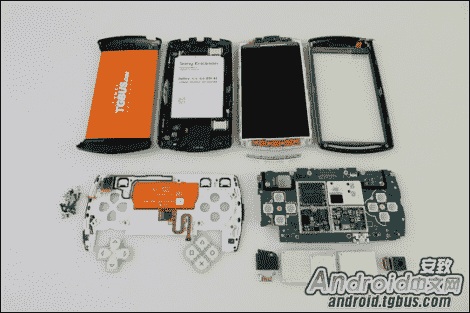

# 拆卸

> 原文：<https://hackaday.com/2011/02/23/xteardown/>

现在小工具世界的一个热门话题是索尼爱立信 XperiaPlay 手机，虽然这不是我们通常的一杯茶，但当我们看到最新的玩具被拆成 n 块时，它激起了我们的兴趣。

这个 8 页的拆除 XperiaPlay ( [谷歌翻译成英文](http://translate.googleusercontent.com/translate_c?hl=en&ie=UTF-8&sl=zh-CN&tl=en&u=http://android.tgbus.com/lab/hardware/201101/339074.shtml&prev=_t&rurl=translate.google.com&twu=1&usg=ALkJrhjKIeV1Sgb5UtrtSF0497Qqnw3dyA))带你经历拆除你的新快乐所需的所有步骤。每个螺丝、夹子、接头和连接器都按顺序摆放，这样您就可以重新组装起来。

随着屠杀的进行，时间被用来指出手机的一些部分。从普通的 I/O 插孔，到更有趣的处理“模拟”杆的 Synaptics 触摸板驱动器，屏幕的 Cypress 多点触摸控制器，当然还有大脑。

(感谢 Frogz)