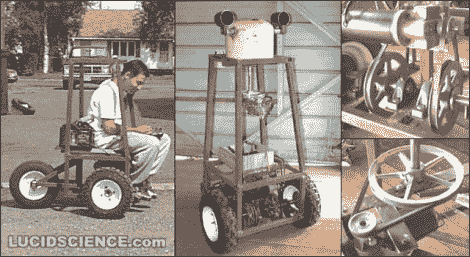

# 数年的机器人项目——为你的享受而倾倒

> 原文：<https://hackaday.com/2011/10/18/years-of-robotic-projects-dumped-for-your-enjoyment/>

认识一下蒂皮，这只是多年来[Oneironaut]承担的众多机器人项目之一。他“深入挖掘”并整合了一个巨大的数据仓库，里面有他以前的机器人项目的图片和描述，然后把它们发布出来供你欣赏。当他周一给 Hackaday 写信时，他提到了其中的 33 页，但他一定是在添加他发现的材料，因为我们看到了 52 页。

这些也不是微型机器人。这些是*我要追捕你，因为我是你最可怕的噩梦*机器人。他们使用沉重的焊接铁框架、铅酸电池和齿轮电机驱动的移动方式。他的一些项目名称包括*坦克*、*哨兵*和*威震天*。将上面看到的链接加入书签，因为你会想要花一些时间在糖果店中筛选项目，这些项目似乎太多了，不仅仅是一个人的爱好。尽管我们不应该感到惊讶，但只要看看他最近推出的众多间谍小工具就知道了，比如全球定位系统跟踪器和远程激光夜视系统。