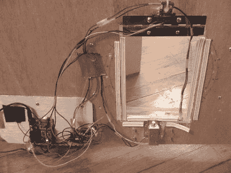

# 又一扇猫门

> 原文：<https://hackaday.com/2011/01/24/yet-another-cat-door/>

RFID 猫皮瓣是我们经常看到的项目之一。它们通常很容易安装，不太贵，对于任何非技术朋友或家人来说都有很好的“惊喜”因素，更不用说非常有用了。为什么我们决定分享[这个](http://www.instructables.com/id/RFID-cat-door/)？首先，这很简单。它不发推特、电子邮件或短信，它只是完成工作。第二，这是很好的记录，包括一个详细的零件清单和一步一步的示意图，几乎任何人都可以用来建立自己的。[landmanr]确实提到他推荐某种项目外壳来保护电子设备免受损坏，这对困在外面的可怜的猫来说是不好的。