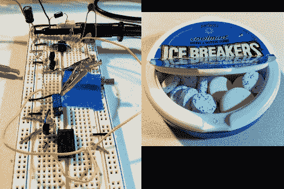

# 你可以保证薄荷糖的安全；我们有技术

> 原文：<https://hackaday.com/2011/06/18/you-can-keep-your-mints-safe-we-have-the-technology/>

在他的薄荷糖消失了相当长一段时间后，奎因·邓基想出了一个主意，要夺回一个清新口气的小偷。一点电路设计、零件清理和自由形式的构造导致了他的[薄荷罐防盗系统](http://www.quinndunki.com/blondihacks/BlondiHacks/Index/Pages/Mintzilla.html)的诞生。

它是这样工作的。在你去吃午饭或喝咖啡之前，打开薄荷罐底部的开关。当满嘴脏话的小偷偷了你的东西时，他们会得到他们开始寻找的东西。但是打开罐头后，他们触发了一个定时电路，这个电路会在打开后很快让薄荷糖在桌子上振动。

上面的试验板包含了原型定时器电路，围绕 555 定时器构建。手机的振动马达是这种黑客的完美选择，因为它非常小，只需等待低压电源即可运行。我们特别喜欢使用 9V 电池内的电池作为电源，以及设法安装在薄荷容器内的紧凑组件。