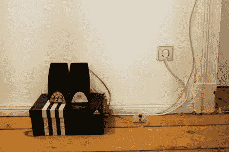

# 你的主题曲在前门迎接你

> 原文：<https://hackaday.com/2012/03/06/your-theme-song-greets-you-at-the-front-door/>

在办公室辛苦工作了漫长的一天后回到家，你可以期待的一件事就是当你进门时听到一些欢快的主题音乐。[Sebastian Sommer]建立了这个系统，并在休息后的视频中通过跳詹姆斯布朗的*我感觉很好*来展示它。

该设置使用 Arduino 作为微控制器。它监控门框上的霍尔效应传感器，该传感器检测门上经过的磁铁。我们猜测这意味着系统不知道你是来还是走，但也许未来的升级会增加一个红外光束来检测你出门时的腿。音乐本身是由 SparkFun MP3 shield 播放的，它有一个解码芯片，microSD 插槽和用于有源扬声器的音频插孔。[Sebastian]拿了一份[比尔·波特的] [mp3 shield 库](http://www.billporter.info/sparkfun-mp3-shield-arduino-library/)让项目快速启动并运行。

如果你已经在用 Arduino 做门锁，这是一个非常酷的附加功能，反之亦然。或者，也许你不在家，不值得这样做，在这种情况下，你必须带上这个[音乐播放特斯拉线圈帽](http://hackaday.com/2011/11/18/a-head-mounted-tesla-coil-what-could-possibly-go-wrong/)上下班。

【维梅奥 http://vimeo.com/37957487 w = 470】